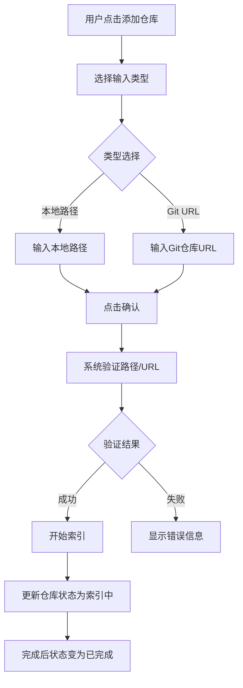
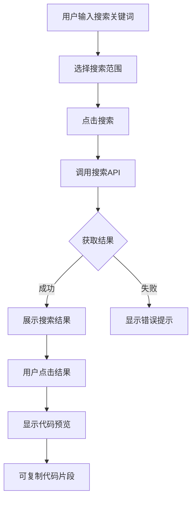

# CodePop Web 管理界面 - 产品需求文档

## 1. 产品概述

CodePop Web 管理界面是一个基于 React 的单页应用，用于管理代码搜索和索引服务。该平台允许用户管理代码仓库、监控索引状态、搜索代码片段，并配置系统设置。

目标用户：开发者和技术团队，需要管理和搜索代码库的管理员和工程师。

## 2. 核心功能

### 2.1 用户角色
| 角色 | 说明 | 核心权限 |
|------|------|---------|
| 管理员 | 系统管理者 | 全部功能，包括仓库管理、搜索、设置 |
| 普通用户 | 开发者 | 查看仓库、搜索代码 |

### 2.2 功能模块
1. **仪表盘 (Dashboard)** - 系统概览、统计数据、快速搜索
2. **仓库管理 (Repos)** - 仓库列表、添加仓库、删除仓库、重新索引
3. **仓库详情 (RepoDetail)** - 单个仓库详细信息、索引进度
4. **代码搜索 (Search)** - 自然语言搜索、结果过滤、代码预览
5. **系统设置 (Settings)** - API 配置、Embedding 提供商、主题切换

### 2.3 页面详情

#### 2.3.1 仪表盘页面
| 模块 | 功能描述 |
|------|---------|
| 统计卡片 | 显示总仓库数、总索引文件数、最近搜索次数 |
| 最近活动 | 显示最近索引的仓库列表及状态 |
| 快速搜索 | 顶部搜索框，支持快速跳转到搜索页面 |
| 快捷操作 | 快速添加仓库按钮 |

#### 2.3.2 仓库管理页面
| 模块 | 功能描述 |
|------|---------|
| 仓库列表 | 卡片形式展示所有仓库，显示名称、路径、状态 |
| 添加仓库 | 表单支持本地路径或 Git URL |
| 批量操作 | 支持批量删除、批量重新索引 |
| 状态筛选 | 按状态（索引中、已完成、错误）筛选 |

#### 2.3.3 仓库详情页面
| 模块 | 功能描述 |
|------|---------|
| 基本信息 | 仓库名称、路径、创建时间、最后索引时间 |
| 索引进度 | 进度条显示当前索引文件数/总文件数 |
| 文件列表 | 显示已索引的文件树结构 |
| 操作按钮 | 重新索引、删除仓库 |

#### 2.3.4 代码搜索页面
| 模块 | 功能描述 |
|------|---------|
| 搜索框 | 支持自然语言查询 |
| 仓库过滤 | 下拉选择要搜索的仓库 |
| 搜索结果 | 显示匹配的代码片段，带语法高亮 |
| 结果操作 | 复制代码、跳转到文件位置 |

#### 2.3.5 系统设置页面
| 模块 | 功能描述 |
|------|---------|
| API 配置 | 设置后端 API 端点地址 |
| Embedding 提供商 | 选择和配置 embedding 提供商 |
| 主题切换 | 支持浅色/深色主题切换 |
| 保存重置 | 保存设置或重置为默认值 |

## 3. 核心流程

### 3.1 添加仓库流程


### 3.2 代码搜索流程


## 4. 用户界面设计

### 4.1 设计风格
- **整体风格**: 现代简洁、工业风格，带有科技感
- **配色方案**:
  - 主色: `#6366F1` (Indigo)
  - 辅助色: `#10B981` (Emerald)
  - 背景色: 深色模式 `#0F172A`，浅色模式 `#F8FAFC`
  - 文字色: 深色 `#F1F5F9`，浅色 `#1E293B`
- **圆角**: 中等圆角 `rounded-lg`
- **阴影**: 柔和阴影 `shadow-lg`
- **字体**: 使用 `Inter` 作为主字体

### 4.2 布局结构
- **导航**: 左侧固定侧边栏，宽度 256px
- **内容区**: 右侧主内容区，内边距 24px
- **响应式**: 桌面端优先，移动端侧边栏可收起

### 4.3 组件状态
| 状态 | 视觉表现 |
|------|---------|
| 默认 | 正常颜色 |
| 悬停 | 背景变亮，阴影加深 |
| 激活 | 主色边框 |
| 禁用 | 透明度 50%，禁止光标 |
| 加载中 | 显示 LoadingSpinner 组件 |

### 4.4 动画效果
- 页面切换: 淡入淡出，300ms ease-out
- 悬停效果: 150ms 过渡
- 加载状态: 脉冲动画
- 列表项: 交错入场动画

## 5. 页面结构

```
/                       → Dashboard (仪表盘)
/repos                  → Repos (仓库列表)
/repos/:id              → RepoDetail (仓库详情)
/search                 → Search (代码搜索)
/settings               → Settings (系统设置)
```

## 6. 技术栈

- **前端框架**: React 18 + TypeScript
- **构建工具**: Vite
- **路由**: React Router v6
- **状态管理**: Zustand
- **数据获取**: React Query (TanStack Query)
- **HTTP 客户端**: Axios
- **样式**: Tailwind CSS
- **图标**: Lucide React
- **语法高亮**: Prism React Renderer
