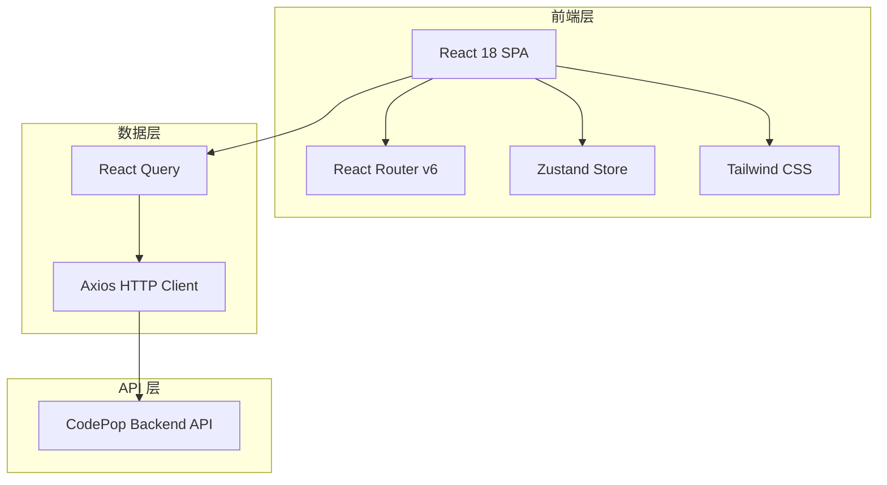

# CodePop Web 管理界面 - 技术架构文档

## 1. 架构设计



## 2. 技术选型

| 技术 | 版本 | 说明 |
|------|------|------|
| React | 18.2.0 | 前端框架 |
| TypeScript | 5.3.3 | 类型安全 |
| Vite | 5.1.0 | 构建工具 |
| React Router | 6.22.0 | 路由管理 |
| Zustand | 4.5.0 | 状态管理 |
| Axios | 1.6.7 | HTTP 客户端 |
| Tailwind CSS | 3.x | 样式框架 |
| Lucide React | latest | 图标库 |
| @tanstack/react-query | 5.x | 数据请求 |

## 3. 目录结构

```
packages/web/
├── src/
│   ├── main.tsx              # 应用入口
│   ├── App.tsx               # 根组件
│   ├── api/                  # API 客户端
│   │   └── index.ts          # Axios 实例和 API 函数
│   ├── components/           # 通用组件
│   │   ├── Layout/           # 布局组件
│   │   │   ├── Sidebar.tsx
│   │   │   ├── Header.tsx
│   │   │   └── Footer.tsx
│   │   ├── RepoCard.tsx
│   │   ├── SearchBox.tsx
│   │   ├── SearchResults.tsx
│   │   ├── CodePreview.tsx
│   │   ├── StatusBadge.tsx
│   │   └── LoadingSpinner.tsx
│   ├── hooks/                # 自定义 Hooks
│   │   ├── useRepos.ts
│   │   ├── useSearch.ts
│   │   └── useIndexing.ts
│   ├── pages/                # 页面组件
│   │   ├── Dashboard.tsx
│   │   ├── Repos.tsx
│   │   ├── RepoDetail.tsx
│   │   ├── Search.tsx
│   │   └── Settings.tsx
│   ├── store/                # Zustand 状态管理
│   │   └── index.ts
│   ├── styles/                # 样式文件
│   │   └── index.css
│   └── types/                 # TypeScript 类型定义
│       └── index.ts
├── package.json
├── tsconfig.json
├── vite.config.ts
├── tailwind.config.js
└── postcss.config.js
```

## 4. 路由定义

| 路由 | 组件 | 说明 |
|------|------|------|
| `/` | Dashboard | 仪表盘首页 |
| `/repos` | Repos | 仓库管理列表 |
| `/repos/:id` | RepoDetail | 仓库详情页 |
| `/search` | Search | 代码搜索页 |
| `/settings` | Settings | 系统设置页 |

## 5. API 定义

### 5.1 基础配置
- **Base URL**: `http://localhost:8080/api/v1` (可配置)
- **Content-Type**: `application/json`

### 5.2 接口列表

#### 仓库相关
```typescript
// 获取仓库列表
GET /repos
Response: { repos: Repo[] }

// 获取单个仓库
GET /repos/:id
Response: { repo: Repo }

// 添加仓库
POST /repos
Body: { path?: string; gitUrl?: string }
Response: { repo: Repo }

// 删除仓库
DELETE /repos/:id
Response: { success: boolean }

// 重新索引
POST /repos/:id/reindex
Response: { success: boolean }
```

#### 搜索相关
```typescript
// 搜索代码
POST /search
Body: { query: string; repoId?: string }
Response: { results: SearchResult[] }
```

#### 统计相关
```typescript
// 获取统计数据
GET /stats
Response: { totalRepos: number; totalFiles: number; recentSearches: string[] }
```

### 5.3 数据模型

```typescript
interface Repo {
  id: string;
  name: string;
  path: string;
  gitUrl?: string;
  status: 'indexing' | 'completed' | 'error';
  totalFiles: number;
  indexedFiles: number;
  createdAt: string;
  lastIndexedAt: string;
}

interface SearchResult {
  repoId: string;
  repoName: string;
  filePath: string;
  lineNumber: number;
  code: string;
  score: number;
}

interface Settings {
  apiEndpoint: string;
  embeddingProvider: 'openai' | 'local';
  theme: 'light' | 'dark';
}
```

## 6. 状态管理 (Zustand Store)

```typescript
interface AppStore {
  // Repository State
  repos: Repo[];
  setRepos: (repos: Repo[]) => void;
  
  // Search State
  searchResults: SearchResult[];
  setSearchResults: (results: SearchResult[]) => void;
  
  // UI State
  theme: 'light' | 'dark';
  setTheme: (theme: 'light' | 'dark') => void;
  sidebarOpen: boolean;
  toggleSidebar: () => void;
}
```

## 7. 组件设计

### 7.1 布局组件 (Layout)
- **Sidebar**: 固定左侧导航，包含 Logo 和菜单项
- **Header**: 顶部工具栏，包含面包屑和用户信息
- **Footer**: 底部版权信息

### 7.2 通用组件
| 组件 | 职责 |
|------|------|
| RepoCard | 展示仓库信息卡片 |
| SearchBox | 搜索输入框，支持自动补全 |
| SearchResults | 展示搜索结果列表 |
| CodePreview | 代码语法高亮预览 |
| StatusBadge | 状态标签组件 |
| LoadingSpinner | 加载动画组件 |

## 8. Hooks 设计

| Hook | 功能 |
|------|------|
| useRepos | 仓库 CRUD 操作 |
| useSearch | 搜索功能和结果管理 |
| useIndexing | 索引操作和进度监控 |

## 9. 错误处理

- API 请求错误统一在 Axios 拦截器处理
- 使用 React Query 的错误边界
- 组件内使用 try-catch 处理业务逻辑错误
- 错误状态通过 Zustand store 统一管理

## 10. 主题系统

使用 Tailwind CSS 的 dark mode 和 CSS 变量：
- 浅色主题：默认 Tailwind 颜色
- 深色主题：通过 `dark:` 前缀覆盖
- 主题状态持久化到 localStorage
